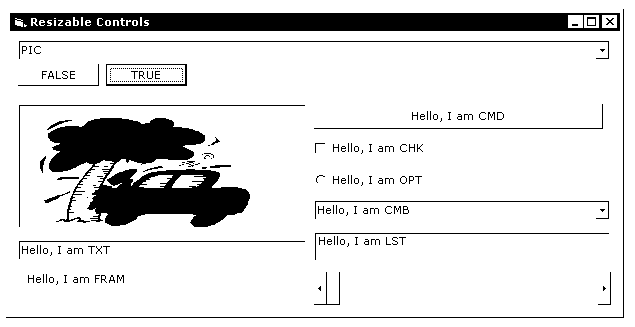



## Resizable Controls at Runtime

### Description

This code implements a module I have written that allows nearly ANY control to be resized at run-time. This would be handy for something like dynamic form design or something of that liking. I am not sure if anyone else has ever done this on PSC before and if they have, I am sorry. In this example I have implemented the module on 9 controls (can be used on many more, I just don't have the time). I am sorry that the screenshot is black and white, though it saved in the wrong format. I hope this helps.
 
### More Info
 

             |
---                |---
**Submitted On**   |2003-09-24 22:34:02
**By**             |[Coding MasterMind](https://github.com/Planet-Source-Code/PSCIndex/blob/master/ByAuthor/coding-mastermind.md)
**Level**          |Intermediate
**User Rating**    |5.0 (20 globes from 4 users)
**Compatibility**  |VB 5\.0, VB 6\.0
**Category**       |[Miscellaneous](https://github.com/Planet-Source-Code/PSCIndex/blob/master/ByCategory/miscellaneous__1-1.md)
**World**          |[Visual Basic](https://github.com/Planet-Source-Code/PSCIndex/blob/master/ByWorld/visual-basic.md)
**Archive File**   |[Resizable\_1649759242003\.zip](https://github.com/Planet-Source-Code/coding-mastermind-resizable-controls-at-runtime__1-48764/archive/master.zip)

